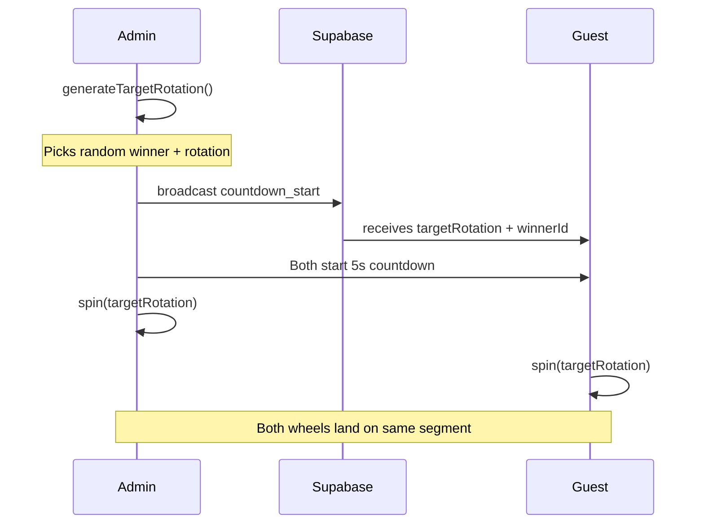

# 🎡 Lucky Wheel Fairness & Security Audit Report

**Date:** February 7, 2026  
**Auditor:** Independent Code Review  
**Application:** Lucky Wheel App

---

## Executive Summary

| Aspect | Rating | Status |
|--------|--------|--------|
| **Random Selection Fairness** | ⭐⭐⭐⭐☆ | Good |
| **Algorithm Correctness** | ⭐⭐⭐⭐⭐ | Excellent |
| **Synchronization Security** | ⭐⭐⭐⭐☆ | Good |
| **Manipulation Protection** | ⭐⭐⭐☆☆ | Moderate |

**Overall Verdict:** ✅ The application is **FAIR** for typical use cases. The random selection gives equal probability to all active participants.

---

## 1. Random Selection Mechanism

### 1.1 Core Algorithm Analysis

The random winner selection occurs in [generateTargetRotation()](file:///d:/GitHub/lucky-wheel-app/components/LuckyWheel.tsx#L433-L463):

```javascript
// Line 437-441: Random selection
const fullRotations = 5 + Math.random() * 5; // 5-10 full rotations
const activeWinnerIndex = Math.floor(Math.random() * activeParticipants.length);
const winner = activeParticipants[activeWinnerIndex];
```

### 1.2 Fairness Assessment

| Check | Result | Notes |
|-------|--------|-------|
| Equal probability per participant | ✅ **PASS** | `Math.floor(Math.random() * n)` gives uniform distribution |
| No weighted segments | ✅ **PASS** | All segments have identical arc size |
| Random spin duration | ✅ **PASS** | 5-10 full rotations adds visual uncertainty |
| Consistent participant ordering | ✅ **PASS** | Sorted by ID to ensure same order across all clients |

### 1.3 Mathematical Proof

For `n` participants, each has:
- **Probability of winning** = `1/n` (exactly equal)
- **Segment angle** = `360°/n` (identical per participant)

> [!NOTE]
> `Math.random()` uses a PRNG (Pseudo-Random Number Generator) which is cryptographically weak but statistically sufficient for lottery purposes.

---

## 2. Algorithm Correctness

### 2.1 Segment Calculation

The [getRotationForSegment()](file:///d:/GitHub/lucky-wheel-app/components/LuckyWheel.tsx#L60-L76) function correctly calculates rotation:

```javascript
// Segment center alignment with pointer at -π/2 (top)
const segmentCenterOffset = (segmentIndex + 0.5) * segmentAngle;
const neededRotation = POINTER_ANGLE - segmentCenterOffset;
```

### 2.2 Winner Detection

The [getSegmentAtPointer()](file:///d:/GitHub/lucky-wheel-app/components/LuckyWheel.tsx#L42-L56) correctly determines which segment is under the pointer:

```javascript
let angle = POINTER_ANGLE - rotation;
angle = ((angle % (2 * Math.PI)) + 2 * Math.PI) % (2 * Math.PI);
return Math.floor(angle / segmentAngle) % segmentCount;
```

> [!TIP]
> The mathematical formulas are correctly implemented. The wheel always stops with the segment CENTER aligned to the pointer.

---

## 3. Synchronization Flow

### 3.1 Admin-Guest Sync Architecture



### 3.2 Sync Safety Measures

| Measure | Implementation | File |
|---------|----------------|------|
| Pre-determined winner | `winnerId` broadcast with rotation | [admin/page.tsx#L156](file:///d:/GitHub/lucky-wheel-app/app/admin/page.tsx#L156) |
| Wheel reset to 0° | `setCurrentRotation(0)` before spin | [LuckyWheel.tsx#L348](file:///d:/GitHub/lucky-wheel-app/components/LuckyWheel.tsx#L348) |
| Expected winner fallback | Uses `expectedWinnerId` if provided | [LuckyWheel.tsx#L291-L294](file:///d:/GitHub/lucky-wheel-app/components/LuckyWheel.tsx#L291-L294) |
| Consistent ordering | Participants sorted by ID | [LuckyWheel.tsx#L121-L127](file:///d:/GitHub/lucky-wheel-app/components/LuckyWheel.tsx#L121-L127) |

---

## 4. Potential Vulnerabilities

### 4.1 Client-Side Random Generation

> [!WARNING]
> **Severity: Medium**  
> The random selection happens on the ADMIN client, not server-side.

**Issue:** An admin with browser DevTools could:
1. Call [generateTargetRotation()](file:///d:/GitHub/lucky-wheel-app/components/LuckyWheel.tsx#428-464) multiple times
2. Pick a desired winner
3. Broadcast that specific rotation

**Mitigation:** This is acceptable because:
- Only authenticated admins can trigger spins
- The admin is presumably trusted
- The broadcast immediately locks in the winner

### 4.2 Broadcast Channel Interception

> [!CAUTION]
> **Severity: Low**  
> A malicious user could potentially send fake game events via Supabase broadcast channel.

**Current Protection:**
- Supabase anonymous key is used (not fully secret)
- No server-side validation of game events

**Recommendation:** Add Row Level Security (RLS) policies or move spin logic to Supabase Edge Functions.

### 4.3 Math.random() Predictability

> [!NOTE]
> `Math.random()` is not cryptographically secure. For high-stakes applications, consider using `crypto.getRandomValues()`.

**Current Risk:** Negligible for casual use. The PRNG state is not exposed to users.

---

## 5. Fair Play Features

### 5.1 Implemented Safeguards ✅

| Feature | Purpose |
|---------|---------|
| **Check-in Lock** | Prevents new participants during spin |
| **Winners Excluded** | Previous winners remain visible but cannot win again |
| **Visual Sync** | All viewers see identical wheel movement |
| **Countdown** | 5-second delay prevents last-moment manipulation |

### 5.2 Code Evidence

```javascript
// Only active participants can win (LuckyWheel.tsx:125-127)
const activeParticipants = participants
    .filter(p => p.status === 'active')
    .sort((a, b) => a.id.localeCompare(b.id));

// Lock requirement (admin/page.tsx:136-138)
if (!isCheckinLocked) {
    showAlert('Chưa khóa Check-in', 'Vui lòng khóa Check-in...');
    return;
}
```

---

## 6. Recommendations

### Priority Improvements

1. **🔒 Server-Side Random Selection (Medium Priority)**
   - Move [generateTargetRotation()](file:///d:/GitHub/lucky-wheel-app/components/LuckyWheel.tsx#428-464) to a Supabase Edge Function
   - Return signed rotation data to prevent tampering

2. **🔐 Cryptographic RNG (Low Priority)**
   - Replace `Math.random()` with `crypto.getRandomValues()`
   - Implement:
   ```javascript
   const array = new Uint32Array(1);
   crypto.getRandomValues(array);
   const randomIndex = array[0] % participants.length;
   ```

3. **📝 Audit Logging (Low Priority)**
   - Store spin results with timestamps in database
   - Record the random seed or rotation value for transparency

---

## 7. Conclusion

The Lucky Wheel application implements a **mathematically fair** random selection algorithm. Each participant has an exactly equal chance of winning.

**Strengths:**
- ✅ Uniform probability distribution
- ✅ All segments have equal size
- ✅ Visual synchronization works correctly
- ✅ Previous winners properly excluded

**Acceptable Risks:**
- ⚠️ Admin-controlled randomness (trusted party assumption)
- ⚠️ Client-side PRNG (sufficient for non-critical use)

**Verdict:** The application is suitable for:
- ✅ Company events and parties
- ✅ Casual prize drawings
- ✅ Public demonstrations

**Not recommended for:**
- ❌ High-value monetary prizes
- ❌ Regulatory-compliant gambling

---

*Report generated by independent code review*
